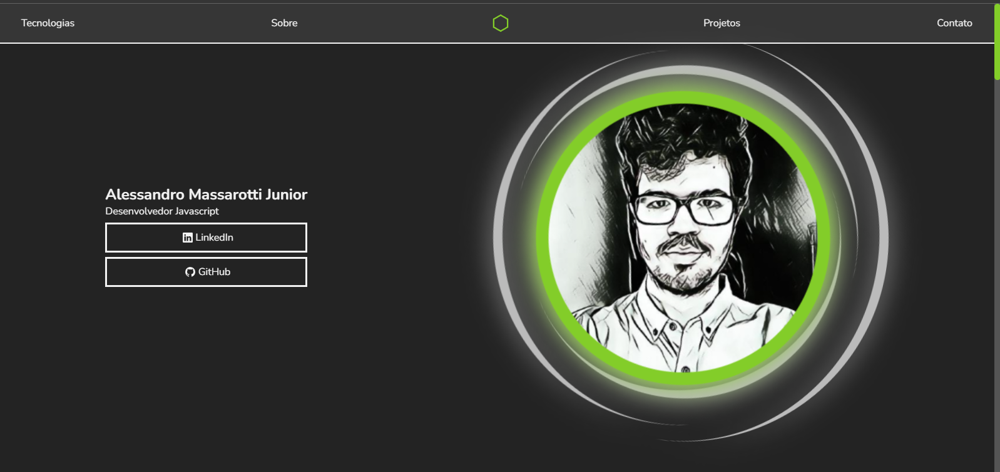

# Portifolio

  
  
  

Meu portifolio online

## start guide

Run `npm installl` to install project dependencies

Run `npm start` to start development server

Run `npm run build` to make a production version of the project

## tecnologies

 - [Iconify](https://iconify.design/)
 - [Three Js](https://threejs.org/)
 - [React Alice carousel](https://github.com/maxmarinich/react-alice-carousel)
 - [React three fiber](https://github.com/pmndrs/react-three-fiber)
 - [React three drei](https://github.com/pmndrs/drei)

## comandos utilicados

`npm i three @react-three/fiber @react-three/drei`

`npm i react-alice-carousel`

`npm install --save-dev @iconify/react`

 

---

Desenvolvido Por [Alessandro Massarotti Jr](https://github.com/alessandro-massarotti-jr) 🤖