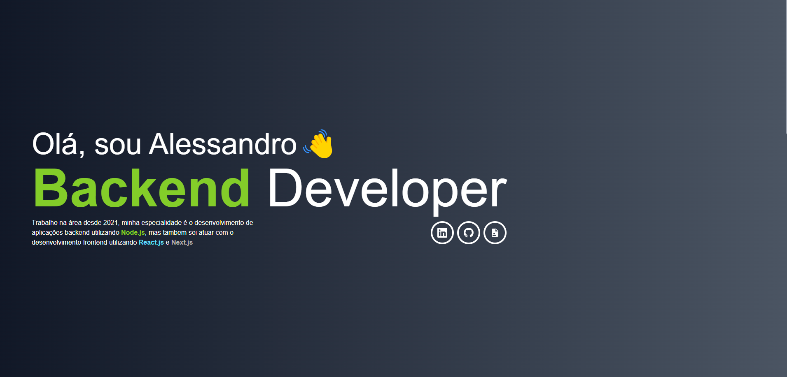

# Portifolio

<p>
  
   
  
  
</p>

Este projeto tem uma proposta bem simples de ser um portifolio digital com alguns de meus projetos



## start guide

### Docker

#### Dev

```bash 
docker compose up
```

#### production image

```bash
# build image
docker build -t portifolio:1.0.0 .

# setup container
docker run -d -p 3000:3000 --name portifolio portifolio:1.0.0
```

### from Scratch

```bash
# Install project dependencies
npm install

# Start dev application
npm run dev 

# make a production version of the project
npm run build 

# start application
npm start
```

## tecnologies

 - [Iconify](https://iconify.design/)
 - [Tailwind](https://tailwindcss.com/)
 - [Next.js](https://nextjs.org/)
 - [Typescript](https://www.typescriptlang.org/)

<br>

---

Desenvolvido Por [Alessandro Massarotti Jr](https://github.com/alessandro-massarotti-jr) 🤖
